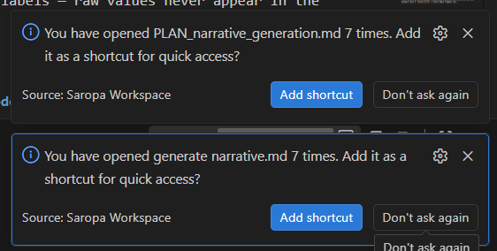

you have to debounce and set a higher limit for documents. files get opened repeatedly during development. that doesn't need permanent pinning.

also need an option to ignore files of a type. i.e. "Ignore .dart"

---

## Resolution (2026-07-10)

Fixed in the open-frequency suggester (`extension/src/views/suggestions.ts`), the
prompt that reads "You have opened {name} {count} times."

1. **Debounce** — a per-file cooldown (`suggestions.debounceMinutes`, default 30)
   collapses a burst of re-focus (search, go to definition, tab flipping) into at
   most one count, so the count tracks distinct working sessions, not focus churn.
2. **Higher limit** — the default open threshold rose from 6 to 10
   (`suggestions.openThreshold`).
3. **Ignore a type** — the prompt gained an "Ignore .ext" action that writes the
   extension to the new `suggestions.ignoreExtensions` setting; files of that type
   are never counted or offered again.

The decision logic was extracted into a pure `evaluateOpen` core with unit tests
(`extension/src/test/suggestions.test.ts`).
